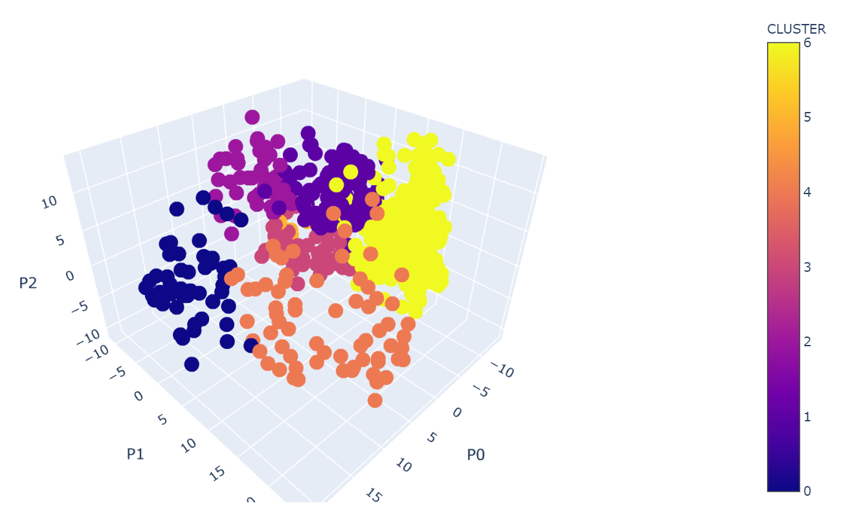
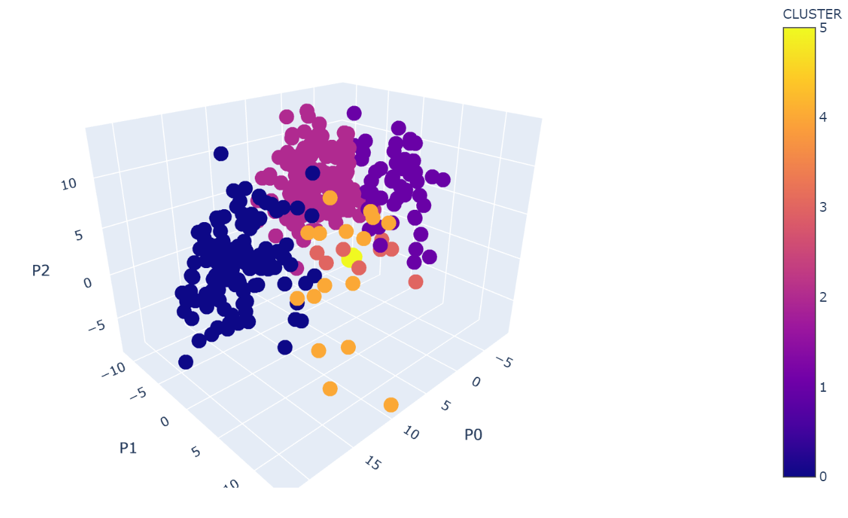
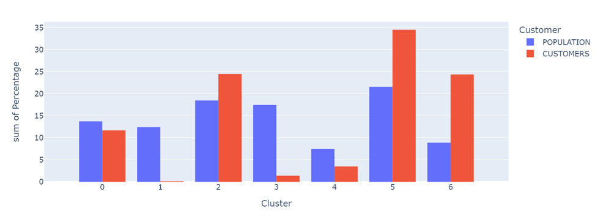
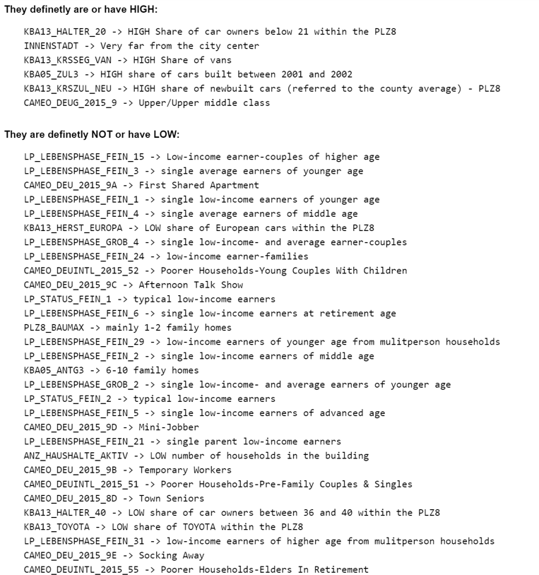

# Software Requirements

## Python libraries

- numpy
- pandas
- matplotlib
- seaborn
- sklearn
- torch
- scipy (Pytorch)
- re (Regular expressions)
- pickle
- os 
- plotly.express

# Project Definition 

## Project overview 

Arvato is an internationally active services company that develops and implements innovative solutions for business customers from around the world (Bertelsmann, 2022). In this project, Bertelsmann and Arvato are looking for methods to acquire customers more efficiently for their Mail-order company (selling organic products). To do so, they have gathered demographic and attribute data from the German population and from already existing customers. These datasets are built from several sources and contain a great variety of information such as demographics, consumer preferences, spending behavior, etc. We should be able to gain insight from this information to find a way to recognize possible customers in a more efficient way. 

## Problem statement 

Develop a machine learning model that can predict how likely a person is to become a customer for Arvato/Bertelsmann mail-order company considering this person’s demographic information. 

Four different datasets are given to find a solution for this problem: a dataset containing demographic information of the German population as a whole; a second dataset with demographics about existing customers of the mail-order company; and a third/fourth (train/test) dataset containing demographics about a group of people that were targeted for a marketing campaign and that responded negatively or positively by becoming a customer.  

## Strategy to solve the problem

The strategy to solve the problem and achieve the business goal is divided into multiple phases:

### Data Cleaning
The datasets contain information from multiple sources. We have a total of 366 feature columns containing both numerical and categorical data. As expected from a dataset coming from many sources, there are a lot of missing values, combined data types, and repeated information. The main objective of this phase is to have a cleaner dataset that could be used for the following phases. This cleaning phase includes: 

- Removing duplicated data
- Removing columns with too many NaN
- Make sure a single data type is present in each column
- Look for numerical columns that are indeed categorical variables 
- Creating dummy columns from categorical data

To effectively execute this cleaning phase, a combination of manual tagging (looking for the meaning of each feature in the provided CSV file), and some automated tasks were required. 

### Dimensionality reduction 
We have a total of 366 features and more than one million samples in the combined datasets! We need to reduce the dimensionality as much as possible for the machine learning algorithms to be efficient. To achieve this a PCA algorithm is used. The data is first centered and then transformed. A compromise between the number of principal components, the explained variance, and the MSE between the original data and the reconstructed data using PCA is found. PCA allows us to reduce the complexity of the dataset by going from 366 initial features to 104 while keeping the explained variance to 90%.

### Unsupervised learning
Once the data has been cleaned and the complexity has been reduced for all available datasets, the next step is to find an Unsupervised Learning algorithm that could tell us more about the demographics present in our datasets. For this purpose, a clustering algorithm using K-means is selected. The process is as follows:
- Use K-means clustering using just in the population data to find the most general representation of the population.
- Find the optimal number of clusters by using the elbow method: comparing the WCSS (cluster’s inertia) with the number of clusters. 
- This population clustering is then applied to the customer dataset. This lets us see how the customers were grouped considering the demographics of the general population.
 
### Supervised Learning
Once the information of the general population has been exploited, we will pass to the actual training set: a mail-out campaign where some people reacted positively (by becoming new customers) and some others negatively (no response received). The supervised model consists of three models whose outputs will be weighted to give a final vote:
 
- A model that uses the information about previously found clusters
- A Random Forest model (optimized using Grid-Search)
- A Neural Network model

The outputs of these three models will be weighted and combined to give a final decision if a given person is more susceptible to being a customer or not.

## Metrics

While tuning the different models, accuracy, precision, and the F1-score are used as auxiliary metrics, however, the most important metric to take into consideration is **recall**. The reason for this is that we care more about reducing the number of false negatives, i.e., people that are tagged as not-customers by the model when they have indeed a high probability of becoming one. 

# Analysis

## Data Exploration

Features and calculated statistics relevant to the problem have been reported and discussed related to the dataset, and a thorough description of the input space or input data has been made. Abnormalities or characteristics about the data or input that need to be addressed have been identified.

## Data Visualization

Build data visualizations to further convey the information associated with your data exploration journey. Ensure that visualizations are appropriate for the data values you are plotting.

# Methodology

## Data Preprocessing

All preprocessing steps have been clearly documented. Abnormalities or characteristics about the data or input that needed to be addressed have been corrected. If no data preprocessing is necessary, it has been clearly justified.

## Implementation

The process for which metrics, algorithms, and techniques were implemented with the given datasets or input data has been thoroughly documented. Complications that occurred during the coding process are discussed.

## Refinement

The process of improving upon the algorithms and techniques used is clearly documented. Both the initial and final solutions are reported, along with intermediate solutions, if necessary.

# Results

## Model Evaluation and Validation

If a model is used, the following should hold: The final model’s qualities — such as parameters — are evaluated in detail.

Some type of analysis is used to validate the robustness of the model’s solution. For example, you can use cross-validation to find the best parameters.

Show and compare the results using different models, parameters, or techniques in tabular forms or charts.

Alternatively, a student may choose to answer questions with data visualizations or other means that don't involve machine learning if a different approach best helps them address their question(s) of interest.

## Justification

The final results are discussed in detail. Explain the exploration as to why some techniques worked better than others, or how improvements were made are documented.

# Conclusion

## Reflection 

Student adequately summarizes the end-to-end problem solution and discusses one or two particular aspects of the project they found interesting or difficult.

## Improvement

Discussion is made as to how at least one aspect of the implementation could be improved. Potential solutions resulting from these improvements are considered and compared/contrasted to the current solution.

